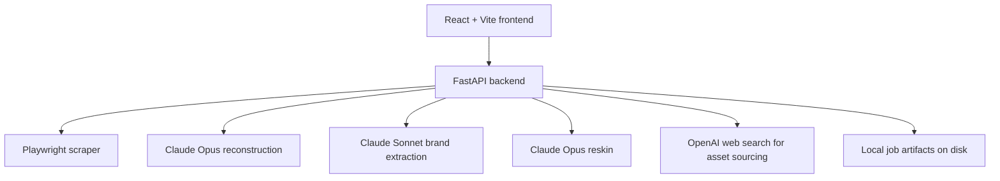

# Architecture and API Flow

## High-Level Architecture

The app is a local full-stack tool with a React frontend and a FastAPI backend.

## Backend Modules

Core backend files:

- [backend/main.py](</C:/Users/91956/Desktop/assignment final/backend/main.py>): FastAPI routes, job lifecycle, validation flow
- [backend/models.py](</C:/Users/91956/Desktop/assignment final/backend/models.py>): request and response models, persisted job record shape
- [backend/scraper.py](</C:/Users/91956/Desktop/assignment final/backend/scraper.py>): Playwright scraping and artifact persistence
- [backend/reconstructor.py](</C:/Users/91956/Desktop/assignment final/backend/reconstructor.py>): reconstruction prompts and repair prompts
- [backend/brand_extractor.py](</C:/Users/91956/Desktop/assignment final/backend/brand_extractor.py>): ad analysis and brand identity JSON extraction
- [backend/reskinner.py](</C:/Users/91956/Desktop/assignment final/backend/reskinner.py>): final branded output generation
- [backend/asset_pipeline.py](</C:/Users/91956/Desktop/assignment final/backend/asset_pipeline.py>): optional asset sourcing and filtering
- [backend/html_guardrails.py](</C:/Users/91956/Desktop/assignment final/backend/html_guardrails.py>): structural validation and browser smoke tests
- [backend/anthropic_utils.py](</C:/Users/91956/Desktop/assignment final/backend/anthropic_utils.py>): retry wrapper for transient Claude failures
- [backend/config.py](</C:/Users/91956/Desktop/assignment final/backend/config.py>): model selection, timeouts, file paths, defaults

## Frontend Modules

Core frontend files:

- [frontend/src/App.tsx](</C:/Users/91956/Desktop/assignment final/frontend/src/App.tsx>): single-page operator experience
- [frontend/src/styles.css](</C:/Users/91956/Desktop/assignment final/frontend/src/styles.css>): current visual system and layout styling
- [frontend/src/main.tsx](</C:/Users/91956/Desktop/assignment final/frontend/src/main.tsx>): app bootstrap

## API Endpoints

### `GET /api/health`

Purpose:

- tells the frontend whether the backend is alive

### `POST /api/scrape`

Input:

- URL
- viewport width
- viewport height

Output:

- job id
- screenshot URL
- DOM JSON URL
- styles JSON URL
- page title
- visible element count

### `GET /api/jobs/{job_id}`

Purpose:

- restore the last job into the frontend after refresh or relaunch

### `POST /api/reconstruct`

Input:

- job id

Behavior:

- reads `screenshot.png`, `dom.json`, and `styles.json`
- generates reconstruction HTML
- runs guardrails
- runs a single repair pass if needed
- saves `reconstruction.html`

### `POST /api/extract-brand`

Input:

- job id
- uploaded ad image

Behavior:

- saves the ad image
- extracts brand identity from the image
- normalizes the JSON shape
- saves `brand-identity.json`

### `POST /api/reskin`

Input:

- job id
- normalized brand identity
- `asset_mode`
- `color_strategy`

Behavior:

- loads the reconstruction
- optionally builds an asset manifest
- reskins the page
- materializes asset placeholders if needed
- runs guardrails
- runs a single repair pass if needed
- saves `reskinned.html`

## Job State and Persistence

Every run is persisted as a `JobRecord` in `job.json`.

This record stores:

- job id
- source URL
- viewport
- current status
- artifact paths
- model names
- token counts
- brand identity
- asset manifest
- error message if the job failed

This persistence enables:

- refresh recovery
- relaunch recovery
- download of final output artifacts
- inspection of what happened in a given run

## Current Implementation Versus Original Spec

The original spec discussed a more iterative compare-and-fix loop. The current implementation is intentionally simpler:

- one primary generation request
- one automated repair pass if validation fails
- structural and browser validation after generation

This was chosen because it kept the pipeline simpler while still producing strong results in practice.
