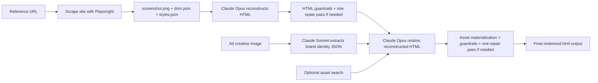

# Product Overview

## Purpose

Design Transfer takes a reference webpage and an ad creative, then generates a branded output page that keeps the original site's layout logic while adopting the new brand's copy, palette, and product framing.

The product is designed around a practical constraint:

- the app is only valuable if the generated page looks good and remains usable

That led to a deliberately simple pipeline with strong models and explicit guardrails rather than a complicated extraction-and-patch system.

## Operator Workflow

The current operator flow is:

1. Enter a public URL
2. Choose a viewport preset
3. Click `Process URL`
4. Upload an ad creative
5. Click `Process Ad`
6. Click `Convert`
7. Choose:
   - preserve site color scheme or use ad color scheme
   - placeholder assets or searched assets
8. Wait for generation
9. Preview the final output
10. Download the final output HTML

The reconstruction HTML still exists internally, but the UI intentionally exposes only the final converted output.

## End-to-End Flow

## What the Product Produces

For each job, the backend stores artifacts inside a job folder under [backend/jobs](</C:/Users/91956/Desktop/assignment final/backend/jobs>).

Common artifacts include:

- `job.json`
- `screenshot.png`
- `dom.json`
- `styles.json`
- `reconstruction.html`
- `reconstruction-guardrails.json`
- `ad-image.<ext>`
- `brand-identity.json`
- `asset-manifest.json`
- `approved-assets/*`
- `reskin-guardrails.json`
- `reskinned.html`

## What the Product Is Optimizing For

The current implementation prioritizes:

- high-quality page generation
- simple operator control
- visually coherent outputs
- safe, self-contained HTML
- reversible asset behavior
- fewer places for brittle automation to fail

It does not prioritize:

- exposing every intermediate artifact in the UI
- full-agent iterative coding loops
- patching HTML through structured JSON diffs
- uncontrolled asset fetching from arbitrary sources

## Current Feature Set

The shipped feature set includes:

- above-the-fold scraping from public webpages
- viewport presets for desktop, tablet, and mobile
- Claude Opus reconstruction
- Claude Sonnet brand extraction from ad creatives
- Claude Opus reskin generation
- optional asset search using official or fallback product imagery
- color-strategy selection at convert time
- placeholder-only mode for deterministic runs
- live preview of the final converted page
- download of the final HTML output

## Intentional Simplifications

Several simplifications were deliberate:

- one launcher instead of multiple batch files
- one output download instead of multiple output variants
- one visible preview area instead of multiple debugging panes
- one convert modal for the most meaningful choices
- one automated repair pass instead of a long retry loop

These choices came directly from quality and usability concerns discovered during implementation.
